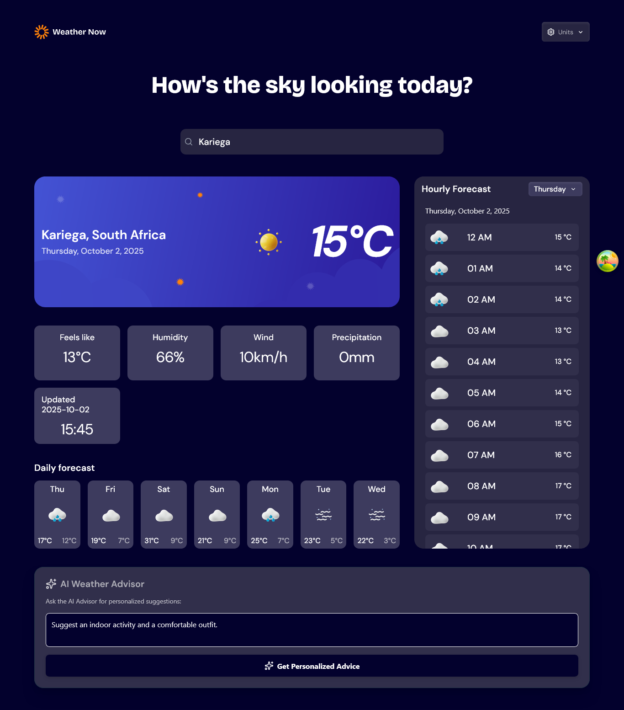

# Weather App

A modern, responsive weather application built with React and enhanced with AI-powered weather advice. This app allows users to search for weather data, view current conditions, detailed forecasts, and switch between units for a tailored experience.

## Table of Contents

- [Overview](#overview)
- [Features](#features)
- [Screenshots](#screenshots)
- [Live Demo](#live-demo)
- [Tech Stack](#tech-stack)
- [Getting Started](#getting-started)
- [Project Architecture](#project-architecture)
- [Learnings](#learnings)
- [Future Improvements](#future-improvements)
- [Useful Resources](#useful-resources)
- [Author](#author)
- [Acknowledgments](#acknowledgments)

## Overview

This web application lets users quickly access weather information for any location. It displays current conditions, hourly and daily forecasts, and allows users to toggle between metric and imperial units. The application features an integrated AI Weather Advisor powered by Google Gemini, offering intelligent, context-aware advice based on the current forecast.

## Features

- Geo-location: get weather details for your current location
- Location Persistence: save current location to local storage to minimize location API search calls.
- Location Search: Search for weather information by location
- Current Conditions: View current weather conditions: temperature, weather icon, and location details
- See additional metrics: feels-like temperature, humidity, wind speed, and precipitation
- Forecasts:  Browse a 7-day weather forecast with daily high/low temperatures
- Hourly forecast with temperature trends and day selector
- Switch between Celsius/Fahrenheit, km/h/mph, and mm/in for precipitation
- AI Weather Advisor: Get tailored, generated advice for the current weather using the Gemini API.
- Responsive design for mobile and desktop
- Accessible UI with hover/focus states

## Screenshots



## Live Demo

- [Live Site URL](https://weather-app-2025-nine.vercel.app/)
- [Frontend Mentor Challenge](https://www.frontendmentor.io/challenges/weather-app-K1FhddVm49)

## Tech Stack

| Component | Technology | Purpose |
|-----------|------------|---------|
| Frontend | React with TypeScript | Main application framework |
| Data & State | TanStack Query | Data fetching and state management |
| Styling & UI | Tailwind CSS & Headless UI | Responsive design and accessible components |
| Weather API | Open-meteo API | Weather data source |
| AI Service | Google Gemini API | AI-powered weather advice |
| Deployment | Vercel serverless functions | Secure API key handling and hosting |

## Getting Started

1. Clone the repository
2. Install dependencies: `pnpm install`
3. Run locally: `pnpm run dev`
4. Open `http://localhost:5173` in your browser

## Project Architecture

A high-level view of the repository structure:

[Project structure link](https://gitingest.com/ChamuMutezva/weather-app-2025)

```js
Directory structure:
└── chamumutezva-weather-app-2025/
    ├── README.md
    ├── eslint.config.js
    ├── index.html
    ├── package.json
    ├── README-template.md
    ├── style-guide.md
    ├── tailwind.config.js
    ├── tsconfig.app.json
    ├── tsconfig.json
    ├── tsconfig.node.json
    ├── vite.config.ts
    ├── api/
    │   └── advice.ts
    ├── public/
    │   └── assets/
    │       ├── fonts/
    │       │   ├── Bricolage_Grotesque/
    │       │   │   ├── README.txt
    │       │   │   └── OFL.txt
    │       │   └── DM_Sans/
    │       │       ├── README.txt
    │       │       └── OFL.txt
    │       └── images/
    │           ├── icon-drizzle.webp
    │           ├── icon-fog.webp
    │           ├── icon-overcast.webp
    │           ├── icon-partly-cloudy.webp
    │           ├── icon-rain.webp
    │           ├── icon-snow.webp
    │           ├── icon-storm.webp
    │           └── icon-sunny.webp
    └── src/
        ├── App.tsx
        ├── ErrorBoundary.tsx
        ├── global.css
        ├── main.tsx
        ├── vite-env.d.ts
        ├── Weather.tsx
        ├── api/
        │   └── geminiService.ts
        ├── components/
        │   ├── AIWeatherAdvisor.tsx
        │   ├── DailyForecast.tsx
        │   ├── DisplayLocation.tsx
        │   ├── Header.tsx
        │   ├── LocationCombobox.tsx
        │   ├── SevenDayHourlyForecast.tsx
        │   ├── SevenDayHourlyForecastDisplay.tsx
        │   └── WeatherToday.tsx
        ├── hooks/
        │   └── react-query.ts
        ├── types/
        │   └── types.ts
        └── utility/
            ├── checkSimilarCoords.ts
            ├── convertToImperial.ts
            ├── getWeatherIcon.tsx
            └── reducers.ts
```

## Learnings

- First time to experiment with Vercel Functions. My project is deployed on Vercel and is created using Vite.
- Along the road in production, I needed to implement a feature to get AI advisory using Gemini AI which invloved the use of an API Key. For development I created a backend to consume the API and for production I used Vercel Serverless functions as a means to prevent exposing the API KEY. FoR the Vercel function to work here are the points to follow:

1. In the root folder create a folder called api and then create the Vercel Serverless function inside the api folder.
2. The docs explain Vercel Serverless functions as `Vercel Functions lets you run server-side code without managing servers. They adapt automatically to user demand, handle connections to APIs and databases, and offer enhanced concurrency through fluid compute, which is useful for AI workloads or any I/O-bound
 tasks that require efficient scaling`. [Vercel Serverless functions](https://vercel.com/docs/functions)
3. See the advice.ts file for the implementation.
4. Add the API KEY in the Vercel dashboard of your project under the `Environment variables` section

```js
import { GoogleGenAI } from '@google/genai';
import type { VercelRequest, VercelResponse } from '@vercel/node'; 

// Define the structure of the data expected from the React frontend
interface RequestBody {
    userPrompt: string;
    systemInstruction: string;
}

// The environment variable name (must be set in Vercel project settings)
const GEMINI_API_KEY = process.env.GEMINI_API_KEY; 

// Initialize the AI client
if (!GEMINI_API_KEY) {
    // In a production environment, throwing an error here is safer than continuing
    throw new Error("GEMINI_API_KEY environment variable is not set.");
}
// Initialize the AI client outside the handler for better performance (hot reloading)
const ai = new GoogleGenAI({ apiKey: GEMINI_API_KEY });
const model = 'gemini-2.5-flash-preview-05-20';


// Use Vercel's types for the handler function
export default async function handler(
    req: VercelRequest, 
    res: VercelResponse // Use the typed response interface
) {
    // 1. Ensure it's a POST request
    if (req.method !== 'POST') {
        // Respond immediately for security and efficiency
        return res.status(405).json({ error: 'Method Not Allowed. Must be POST.' });
    }

    try {
        // 2. Safely cast the request body to the expected interface
        const { userPrompt, systemInstruction } = req.body as RequestBody;

        // Type checking: ensure userPrompt is a valid string
        if (typeof userPrompt !== 'string' || userPrompt.trim() === '') {
            return res.status(400).json({ error: "Missing or invalid 'userPrompt' in request body." });
        }

        // 3. Call the Gemini API
        const result = await ai.models.generateContent({
            model: model,
            contents: [{ parts: [{ text: userPrompt }] }],
            config: {
                systemInstruction: {
                    parts: [{ text: systemInstruction || "You are a helpful assistant." }] // Use a fallback system instruction
                }
            }
        });
        
        const generatedText = result.candidates?.[0]?.content?.parts?.[0]?.text || 
                             "Failed to generate advice.";

        // 4. Send the successful response back to the React client
        // TypeScript now validates that the response matches ResponseData (text is required here)
        res.status(200).json({ text: generatedText });
    
    } catch (error) {
        console.error('Gemini API Error:', error);
        // Ensure the error response also matches ResponseData (error message is required here)
        res.status(500).json({ 
            error: 'An internal error occurred during AI advice generation.' 
        });
    }
}
```

## Future Improvements

- Enable weather alerts/notifications
- Improve loading and error states
- Add more detailed hourly forecast graphs
- Optimize for performance and SEO

## Useful Resources

- [React documentation](https://react.dev/)
- [Vite documentation](https://vite.dev/guide/)
- [Tailwind CSS](https://tailwindcss.com/docs)
- [Open-meteo API](https://open-meteo.com/en/docs)
- [TanStack query](https://tanstack.com/)
- [Headless-ui](https://headlessui.com/react/menu)

## Author

- Name: Chamu Mutezva
- Frontend Mentor: [@ChamuMutezva](https://www.frontendmentor.io/profile/ChamuMutezva)

## Acknowledgments

Thanks to Frontend Mentor and the open-source community for resources and inspiration.
